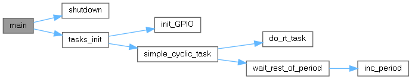

# Setting up a Raspberry Pi 4B for Real-Time Ubuntu 24.04LTS
The goal of this repository is to recompile information scattered across the web into a little cookbook of how to setup a Raspberry Pi 4B for (soft) real-time performance.

This repository was co-authored with [clpter](https://github.com/clpter).
>## Disclaimer
>This document originates from a lab exercise and describes what worked for me on a Raspberry Pi 4B with Real-Time Ubuntu. We are not absolute experts, and while we’ve tried to be accurate, mistakes or omissions may remain.
>
>Results and performance figures are specific to our hardware, kernel version, and configuration; they may differ on other setups. Use at your own risk, and verify steps before applying them to another setup, especially in safety-critical contexts.
>
>Contributions and corrections are welcome.
## Prerequisites
- A Raspberry Pi 4B (preferably the 8GB model)
- A heatsink with fans for the Raspberry Pi 4B
- An Ubuntu Pro account
## Raspberry Pi Setup
### Installing Ubuntu 24.04LTS
- The setup begins with preparing a flash memory card using the Raspberry Pi Imager, a tool provided by Raspberry Pi Ltd.
    - On Windows hosts, the imager must be downloaded from the official Raspberry Pi Software website⁽⁷⁾
    - On Linux systems that use the apt package manager (e.g., Debian or Ubuntu), the following command installs the imager⁽⁷⁾:
    ```
    sudo apt install rpi-imager
    ```
- The next step is to acquire the Ubuntu image for the Raspberry Pi:
    - The image can be downloaded manually from the official Ubuntu Raspberry Pi page⁽⁸⁾
    - Alternatively, the Raspberry Pi Imager can be used to fetch the image directly (Explained in the next step)
- The Raspberry Pi Imager is used to flash the new operating system to a microSD card:
    - The correct device model (e.g., Raspberry Pi 4) is selected
    - The Ubuntu Desktop 24.04 image is chosen in one of two ways:
        - If no image was downloaded from Canonicals website, one can be chosen here by selecting `Other general-purpose OS` > `Ubuntu` > `Ubuntu Desktop 24.04.X LTS (64-Bit)`
        - If an image has been already downloaded from Canonicals website, there is an option at the very bottom of the list called `Own Image`
        - After selecting this option the path to the downloaded image has to be specified
    - The microSD card is inserted and selected as the flash target
    - Additional configuration options are also presented:
        - Setting a default username/password
        - Optionally pre-configuring a Wi-Fi connection beforehand
        - etc.
    - After confirming all selections, the flashing process is initiated
    - The image is written and verified automatically
- While the SD card is being prepared, an Ubuntu Pro account should be created
    - Ubuntu Pro is required to enable the real-time kernel
    - An Ubuntu Pro account can be created free of charge for personal use on the Ubuntu Pro website⁽⁹⁾
    - The following information is required:
        - E-Mail
        - Full Name
        - Desired username
        - Password
    - After the account is created, a personal Ubuntu Pro token can be obtained via the Ubuntu dashboard⁽¹⁰⁾
    - This token will be needed for linking a machine to a Ubuntu Pro subscription later.
- After the flashing process has completed, the SD card is inserted into the Raspberry Pi, and the system is powered on
- Ubuntu will automatically start the install/setup procedure upon the first boot
    - Some more configuration options will be asked such as:
        - Keyboard layout
        - Time zone
        - etc.
    - It is also possible to activate Ubuntu Pro at this step
    - If an account has been already set up, then the instructions in the installer can be followed to link the machine to a subscription
    - This can also be done at a later point using the terminal or the system settings
- On setup completion, the system reboots
- After rebooting, the user must log in using their credentials
- A terminal needs to be started:
    - This can be either done via the graphical application launcher by finding the “Terminal” application
    - Or by alternatively using the keyboard shortcut `CTRL+ALT+T`
- It is recommended to update the system to the latest version. This is achieved with the following command: `sudo apt update`⁽¹¹⁾
- If Ubuntu Pro was not activated previously, then it can be done now by retrieving the token from the Ubuntu Pro dashboard⁽¹⁰⁾ and running⁽¹¹⁾:
```
sudo pro attach <YOUR-TOKEN>
```
- It should also be ensured that the Ubuntu Advantage client (responsible for handling Ubuntu Pro subscriptions) is installed and up-to-date. To check, the following command has to be executed⁽¹¹⁾:
```
sudo apt install ubuntu-advantage-tools
```
- Once everything is ready, the real-time variant of the Ubuntu kernel can be installed using the following command⁽¹¹⁾:
```
sudo pro enable realtime-kernel --variant=raspi
```
- <b><u>Warning: Do not omit `--variant=raspi` or the wrong variant may be installed, resulting in a broken system!⁽¹¹⁾</b></u>
- A warning will appear that Canonical Livepatch must be disabled
- This must be accepted to proceed and can be done by pressing y⁽¹¹⁾
- After the installation of the real-time kernel package runs its course and completes, the system must be restarted. This can be done with: `sudo reboot`
- The real-time kernel is installed after the system restarts
- This can be verified by executing the command: `uname -r -v` ⁽¹²⁾
    - The `-r` flag specifies the kernel release version string
    - The `-v` flag specifies the kernel build version
    - An output after a successful installation is:
    ```
    6.8.0-2019-raspi-realtime #20-Ubuntu SMP PREEMPT_RT Thu Feb 27 14:16:18 UTC 2025
    ```
- If the system reports as `PREEMPT_RT`, then the real-time kernel is active and everything is functioning correctly
### Installing testing software and testing
- To determine the real-time capabilities, dedicated tools for measuring scheduling latency and stressing the CPU are needed
- Two commonly utilized tools for this purpose are `cyclictest` and `stress-ng`⁽¹³⁾
- `cyclictest` is a common benchmarking suite specifically designed to access the determinism of real-time systems⁽¹⁴⁾
- It measures latency by creating one or more POSIX thread(s), which continuously schedule a high-resolution timer to fire at a fixed interval specified by the user⁽¹⁴⁾
- The latency measured is the delay from the interrupt trigger to the handling of the request and waking up⁽¹⁴⁾
- `cyclictest` repeats these measurements for millions of cycles and notes all the times, creating a minimum, a maximum and an average
- The maximum is especially important, as a system is considered hard real-time when it defines the upper bound (maximum time) a system needs to respond to an event
- To install `cyclictest`, the `rt-tests` package is used:
```
sudo apt install rt-tests
```
- `stress-ng` is a versatile software suite of workload generators to stress test a system using a wide variety of configurable stressor programs⁽¹⁵⁾
- In the context of real-time systems, `stress-ng` is usually run alongside `cyclictest` to assess whether a system can remain within its maximum latency bounds even under load
- It is installed by installing its package:
```
sudo apt install stress-ng
```
- Together, `cyclictest` and `stress-ng` provide a comprehensive testing environment for benchmarking and validating the effectiveness of a real-time kernel
- The detailed usage of these tools, including the specific parameters and a test scenario, is covered in a later section
### Tuning the system
- The `PREEMPT_RT` kernel already provides a large improvement over the standard kernel (ca. 10x improvement in latency)
- However further optimizations can be performed to minimize latency sources
- The first fundamental improvement is to disable unused peripheral interfaces. On the Raspberry Pi, this can be achieved using the `raspi-config` tool provided by Raspberry Pi Ltd.⁽¹⁶⁾:
    - The `raspi-config` tool is originally designed for Raspberry Pi OS
    - However, as Raspberry Pi OS is simply a Debian-based distribution tailored for the Raspberry Pi OS, this tool is also available on Ubuntu, which is Debian-based as well
    - It is installed via:
    ```
    sudo apt install raspi-config
    ```
    - It is then launched with:
    ```
    sudo raspi-config
    ```
    - This will start the utility, which presents a text-based menu similar to legacy BIOS interfaces
    - Navigation is done with Arrow keys, options are selected with `ENTER` and going back is possible with `ESCAPE`
    - Before making changes, one should select Option 8 `“Update”` and perform a check to make sure the software is up-to-date
    - Next, interface settings are accessed by selecting Option 3 `“Interface Options”`
    - This menu has options for enabling/disabling interfaces, such as:
        - Legacy Camera
        - SSH
        - VNC
        - SPI
        - I2C
        - Serial Port
        - 1-Wire
        - Remote GPIO
    - Only GPIO is relevant for the given real-time use case
    - Therefore it is recommended to disable all Options except `“Remote GPIO”`
    - This minimizes the number of active kernel drivers and interrupt handlers, which in turn eliminates possible interrupt sources and improves determinism
    - Once the changes are applied, you can exit the configuration
- Another essential optimization includes isolating a CPU core from the system to be a core exclusively dedicated for real-time tasks:
    - This is done through the kernel command line, which is in the file `/boot/firmware/cmdline.txt`⁽²⁰⁾
    - This is a single-line configuration file parsed by the kernel during the boot process
    - Root privileges are required to edit it:
    ```
    sudo nano /boot/firmware/cmdline.txt
    ```
    - <b><u>Warning: This file must contain only one line. Do not insert line breaks. Do not edit existing parameters. Improper modification will make the system unbootable!</b></u>
    - If in doubt, cross-reference with Appendix A at the end of this document for a working configuration
    - To configure core isolation, the following keywords have to be added after the fixrtc keyword:
        - `nohz=on`: Enables tickless idle/adaptive-tick mode, reducing timer interrupts⁽¹⁷⁾
        - `nohz_full=1`: Specifies which CPU(s) is/are in adaptive tick mode, meaning they run without periodic scheduling interrupts⁽¹⁷⁾
        - `isolcpus=1`: Isolate the specified CPU(s), preventing the scheduler from assigning regular tasks to these cores⁽¹⁸⁾
        - `rcu_nocbs=1`: Deactivates callbacks for the specified CPU(s) core, further reducing non-deterministic workloads⁽¹⁷⁾
    - For all the settings, CPU core 1 is taken as a setup example, but any other core combination can be specified using e.g. `0,2,3` or `1-3`⁽¹⁸⁾
    - CPU core 1 is taken in this case because CPU core 0 is typically mandated to do system-critical operations such as handling timer ticks, IRQs and housekeeping
    - Designating CPU core 1 as a real-time core instead avoids any unnecessary interference and unpredictability, further improving temporal determinism
    - To apply the settings after making the changes, one must save with `CTRL+S` and then exit nano with `CTRL+X`
    - The system must be rebooted for the changes to take effect: `sudo reboot`
    - After rebooting, the isolated cores can be verified with:
        ```
        cat /sys/devices/system/cpu/isolated
        ```
    - This command should output the numbers of the isolated cores if everything was applied successfully
    - By having an isolated core, it can be ensured that the system exhibits stronger temporal determinism, as there are no interferences from the operating system or tasks that might impact the execution of real-time tasks
- In addition of isolating a CPU core, it is also necessary to redirect hardware interrupts away from the isolated core:
    - This setting is again applied in the `/boot/firmware/cmdline.txt` file⁽²⁰⁾
    - To edit this file:
    ```
    sudo nano /boot/firmware/cmdline.txt
    ```
    - Same precautions as earlier apply
    - To redirect interrupts away from Core 1, the following parameter is applied after the previously added options: `irqaffinity=0,2,3`⁽¹⁸⁾
    - `irqaffinity` specifies which CPU cores are permitted to be handling interrupts⁽¹⁸⁾
    - After omitting Core 1 from this parameter the system is instructed to not deliver any IRQs to that core
    - This is essential for ensuring core isolation and protecting real-time tasks from latency spikes caused by hardware and the operating system
    - After modifying the line, the file must be saved with `CTRL+S` and closed with `CTRL+X`
    - The system has to be rebooted again to apply the changes
    - To inspect the individual interrupt affinities of each interrupt, the content of `/proc/irq/X/smp_affinity` has to be checked⁽²¹⁾
    - For example with cat⁽²¹⁾: 
    ```
    cat /proc/irq/X/smp_affinity
    ```
    - X being the number of interrupt to check
    - For automation of the verfication of the IRQ affinity settings, a helper script is included in this repository under the folder `source`, which iterates over all interrupt affinities and outputs them to the console
    - To use it, it has to be copied into a file (for example `affinitytest.sh`) and then made executable with:
    ```
    chmod +x affinitytest.sh
    ```
    - After that it can be started by writing `./affinitytest.sh`
    - All interrupts but 32-35 should have the desired interrupt affinity set
    - <b>NOTE:</b> The interrupt affinity mask is a bit mask (for example d = 1101)
    - As already mentioned, interrupts 32-35 are used to handle ARM mailboxes and are hard-coded to one CPU core each⁽⁴⁾
- For consistent real-time performance, CPU frequency must be disabled as well
- Dynamic frequency scaling introduces variability in execution timing, which hinders temporal determinism:
    - To disable it the systems CPU governor has to be configured
    - For this, an utility has to be installed:
    ```
    sudo apt install cpufrequtils
    ```
    - After installing the configuration file under `/etc/default/cpufrequtils` has to be opened:
    ```
    sudo nano /etc/default/cpufrequtils
    ```
    - In the file, two new lines have to be added
        - `GOVERNOR=”performance”`⁽²²⁾
        - The `GOVERNOR` option `“performance”` turns off power-saving measures by setting the CPU into performance mode⁽²²⁾
        - `MIN_SPEED=”1.8GHz”`
        - The `MIN_SPEED` option specifies to what speed the CPU is allowed to throttle down to if idle
        - By setting it to 1.8GHz (Raspberry Pi 4Bs maximum turbo frequency) frequency scaling is effectively disabled as the CPU is not allowed to go below its maximum
        - To apply the changes, the file has to be saved and exited
        - It is then applied with:
        ```
        sudo /etc/init.d/cpufrequtils restart
        ```
    - With this it has been observed that some frequency scaling still happens however
    - To fix that, a more drastic measure is taken by setting an overclocking flag called `force_turbo=1`⁽²³⁾:
        - This is done within `/boot/firmware/config.txt`
        - <b><u>!!! Warning: Doing this sets a permanent bit on the SoC that voids the warranty of the Raspberry Pi !!!⁽²⁴⁾</b></u>
        - When doing this a cooling solution will also need to be installed on the Raspberry Pi⁽²⁴⁾ 
        - In the case of the test Pi a heat sink with 2 fans was installed (Pictured below)
        - This cooling solution is sufficient for keeping the Raspberry Pi under ca. 60°C

            
- As a final tuning step, onboard wireless communication modules (Wi-Fi and Bluetooth) are disabled to reduce interrupt load and background activity:
    - Wi-Fi and Bluetooth can be disabled at the firmware level using device tree overlays.
    - For this the file `/boot/firmware/config.txt` has to be edited
    - This is achieved by modifying the `/boot/firmware/config.txt` file in the boot partition:
    ```
    sudo nano /boot/firmware/config.txt
    ```
    - Two lines have to be added at the end of the file:
        - `dtoverlay=disable-wifi`⁽²⁵⁾
        - `dtoverlay=disable-bt`⁽²⁵⁾
    - These overlays instruct the Raspberry Pi firmware to fully disable the Wi-Fi and Bluetooth subsystems, preventing their kernel drivers from loading and eliminating related background tasks and interrupts⁽²⁵⁾
    - This is of importance because WiFi and Bluetooth send out constant signals and poll various things, meaning they generate constant interrupts
    - Access to the internet can still be provided via Ethernet
### Testing real-time performance
- To assess the effectiveness of the applied system tuning and validate the real-time capabilities of the Raspberry Pi 4 running Ubuntu 24.04 with the `PREEMPT_RT` kernel, a 24-hour latency stress test was conducted
- The objective of this test was to evaluate the maximum interrupt latency experienced #by a high-priority thread bound to the isolated core, under continuous CPU load on the remaining cores
- This simulates a worst-case scenario in which real-time responsiveness must be guaranteed despite high system utilization
- Two tools were used in parallel:
    - `cyclictest` to measure scheduling latency
    - `stress-ng` to generate background CPU load
- The test was executed with the following parameters:
    - cyclictest was pinned to CPU core 1, the previously isolated real-time core:
    ```
    sudo taskset -c 1 cyclictest -m --smp --priority=99 –interval=200
    ```
    - The parameters:
        - `-m`: Lock memory to prevent paging
        - `--priority=99`: Use real-time FIFO policy with the highest priority
        - `--interval=200`: Set a 200us interval between timer expirations
        - `--smp`: Enable multiprocessing support
    - `stress-ng` was configured to fully utilize the remaining cores (0, 2, and 3):
    ```
    sudo stress-ng --cpu 3 --cpu-load 100 --taskset 0,2,3 --all 4
    ```
- The system was left running for 24 hours to capture a representative and statistically significant distribution of latencies under sustained load
- The test results from cyclictest were as follows:
    - Minimum latency: `15us`
    - Average latency: `23us`
    - Maximum latency: `190us`
- These results indicate that even under sustained system load, maximum latency remained below `200us`, which is a strong result for a non-dedicated embedded system
- The low worst-case latency demonstrates the effectiveness of the combined tuning strategies
- The accompanying stress-ng output confirmed a successful run with all stressors active and no failures or skipped workloads, further validating the load conditions
- The raw output log of the tests can be found under the folder `24h_test_logs` of this repository
## Software implementation
- The documentation featured in this section of the document is focused on the implementation of a simple program to demonstrate a real-time task
- The application to implement is a parallel/GPIO port square signal generator with an adjustable frequency
- The structure of the program contains two tasks; one for setting the square output signal to a high level and one for setting the output signal to a low level
- The tasks themselves are translated to the POSIX pthread model with a FIFO scheduler and a task priority of 99⁽¹⁾
- To emulate the periodic task type of RTAI type of real-time tasks helper functions are implemented:
    - inc_period(): Increases the period of the task → Sets the time when a task has to wake up⁽²⁾
    - do_rt_task(): Defines what the task has to do⁽²⁾
    - wait_rest_of_period(): Let the task wait until the period ends⁽²⁾
    - simple_cyclic_task(): Main function of the pthread, houses the while loop and calls the helper functions
- For precise timing the clock_nanosleep() method is used, which sets the tasks to sleep until a specific time point⁽²⁾
- inc_period() ensures absolute timing and guards against time drift⁽²⁾
- The function init_GPIO() initializes global variables for GPIO communication such as opening a line and setting it to the output mode⁽³⁾­
- In order to give the task information about its specific period and starting time, the time_info struct was created
- This struct is filled with the wake up time of the next period and period length at runtime
- This struct is passed to the pthreads⁽²⁾
- In the function tasks_init() the starting times are initialized and the tasks are started⁽²⁾
- To give a better overview of the programs structure, a caller graph on start-up and of the cyclic task loop is available:
### Caller graph on startup



### Caller graph for the main loop


## Evaluation
- The initial idea was to make a Raspberry Pi 4B hard real-time compatible using Real-Time Ubuntu
- Attempts to make the Raspberry Pi a hard real-time systems have not been successful
- Hard real-time capability on the Raspberry Pi 4B is not achieved
- After extensive attempts to isolate the hardware as much as possible there are still nondeterministic factors which can cause unbounded latency
- Some factors would be:
    - USB communication (VL805 USB-3-Controller interrupts)
        - The USB bus can restart or hang/crash unexpectedly, causing a large latency spike
    - HDMI communication (VideoCore interrupts)
        - The video interrupts are all outside of the ARM CPU and thus cannot be controlled
        - However they must be handled. These video interrupts can arrive at any time and reserve the bus for a long time, causing a latency spike
        - These interrupts can be further examined as well in the official Raspberry Pi BCM2711 documentation on page 86 in figure 5 and further⁽⁴⁾
    - ARM GIC-400 interrupt controller hard-coding interrupts to specific cores
        - The interrupts 32-35 have a fixed affinity mask for each one of the cores as they handle mailboxes
        - These cannot be changed and as a result a core may be interrupted to handle ARM mailbox messages, causing latency spikes
        - This assignment can be seen in the official Raspberry Pi BCM2711 ARM Peripherals documentation on page 90 under figure 7, where ARM Mailbox IRQs are bound to SPI IDs 32-47 (Linux only utilizes the first 4 Mailboxes)⁽⁴⁾
- With that being said, the performance of the Raspberry Pi as a budget soft real-time system is excellent
- A maximum latency of 190us and an average latency of 24us under a high work load is measured in the 24 hour test
- The PREEMPT_RT kernel with tuning does lead to a large improvement in determinism
- Only a few factors remain that unbound maximum latency
- For demonstration purposes an example application was created and is available under the folder `source` of this repository
- When starting the program however, a Jitter of about 50µs is visible when moving the mouse.
    - One reason could be that clock_nanosleep() has its limits.
    - Another reason could be, that the library libgpiod is the bottleneck. 
    - In one version of the program the hardware register was attempted to be used of the GPIO pins more directly with mmap, but even then the jitter was the same⁽⁵⁾
    - For extremely high speed PWM signals this setup can not be recommended, but there are workarounds, e.g. the pigpio library can be used for very precise hardware PWM signals⁽⁶⁾
## Appendixes
### Appendix A
#### A complete example of /boot/firmware/cmdline.txt (isolating CPU 1)
```
zswap.enabled=1 zswap.zpool=z3fold zswap.compressor=zstd multipath=off dwc_otg.lpm_enable=0 console=tty1 root=LABEL=writable rootfstype=ext4 rootwait fixrtc nohz=on nohz_full=1 isolcpus=1 rcu_nocbs=1 irqaffinity=0,2,3 cpuidle.off=1 quiet splash cfg80211.ieee80211_regdom=DE
```
## Sources
1. [“HOWTO build a simple RT application”](https://wiki.linuxfoundation.org/realtime/documentation/howto/applications/application_base), The Linux Foundation, 07.06.2025
2. [“HOWTO build a basic cyclic application”](https://wiki.linuxfoundation.org/realtime/documentation/howto/applications/cyclic), The Linux Foundation, 07.06.2025
3. [“libgpiod 2.0-devel”](https://phwl.org/assets/images/2021/02/libgpiod-ref.pdf), libgpiod project, 07.06.2025
4. [“BCM2711 ARM peripherals”](https://datasheets.raspberrypi.com/bcm2711/bcm2711-peripherals.pdf), Raspberry Pi Ltd., 04.05.2025
5. [“mmap – map pages of memory”](https://pubs.opengroup.org/onlinepubs/9799919799/), The Open Group Base Specifications Issue 8, The IEEE and The Open Group, 07.06.2025
6. [“The pigpio library”](https://abyz.me.uk/rpi/pigpio/), pigpio project, 07.06.2025
7. [“Install Raspberry Pi OS using Raspberry Pi Imager”](https://www.raspberrypi.com/software/), Raspberry Pi Ltd., 28.04.2025
8. [“Install Ubuntu on a Raspberry Pi”](https://ubuntu.com/download/raspberry-pi), Canonical Ltd., 28.04.2025
9. [“Ubuntu Pro”](https://ubuntu.com/pro), Canonical Ltd., 28.04.2025
10. [“Your subscriptions”](https://ubuntu.com/pro/dashboard), Canonical Ltd., 28.04.2025
11. [“How to enable Real-time Ubuntu”](https://documentation.ubuntu.com/pro-client/en/latest/howtoguides/enable_realtime_kernel/), Canonical Ltd., 28.04.2025
12. [“uname – print system information”](https://www.man7.org/linux/man-pages/man1/uname.1.html), Free Software Foundation, 28.04.2025
13. [“Discover real-time kernel on Ubuntu 24.04 LTS and Raspberry Pi”](https://www.youtube.com/watch?v=lu9tMy2Ylhg), ca. 42:00, Canonical Ubuntu, 28.04.2025
14. [“Cyclictest”](https://wiki.linuxfoundation.org/realtime/documentation/howto/tools/cyclictest/start), The Linux Foundation, 04.05.2025
15. [“stress-ng - a tool to load and stress a computer system”](https://manpages.ubuntu.com/manpages/bionic/man1/stress-ng.1.html), Colin King & Amos Waterland, 04.05.2025
16. [“Configuration – raspi-config”](https://www.raspberrypi.com/documentation/computers/configuration.html), Raspberry Pi Ltd., 12.05.2025
17. [“NO_HZ: Reducing Scheduling-Clock Ticks”](https://www.kernel.org/doc/Documentation/timers/NO_HZ.txt), The kernel development community, 12.05.2025
18. [“The kernel’s commandline parameters”](https://docs.kernel.org/admin-guide/kernel-parameters.html), The kernel development community, 12.05.2025
19. [“CPU Idle Time Management”](https://kernel.org/doc/html/v5.0/admin-guide/pm/cpuidle.html#idle-states-control-via-kernel-command-line), The kernel development community, 12.05.2025
20. [“How to modify kernel boot parameters”](https://documentation.ubuntu.com/real-time/en/latest/how-to/modify-kernel-boot-parameters/), Canonical Ltd., 12.05.2025
21. [“SMP IRQ affinity”](https://docs.kernel.org/core-api/irq/irq-affinity.html), The kernel development community, 18.05.2025
22. [“CPU performance scaling”](https://www.kernel.org/doc/html/latest/admin-guide/pm/cpufreq.html), Rafael J. Wysocki, Intel Corporation, 21.05.2025
23. [“config.txt”](https://www.raspberrypi.com/documentation/computers/config_txt.html#force_turbo), Raspberry Pi Ltd., 21.05.2025
24. [“Overclocking options”](https://github.com/raspberrypi/documentation/blob/develop/documentation/asciidoc/computers/config_txt/overclocking.adoc), Raspberry Pi Ltd., 21.05.2025
25. [“firmware/boot/overlays”](https://github.com/raspberrypi/firmware/tree/master/boot/overlays), Raspberry Pi Ltd., 21.05.2025